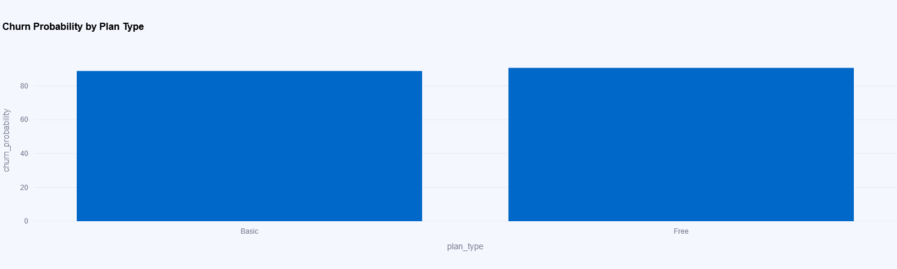
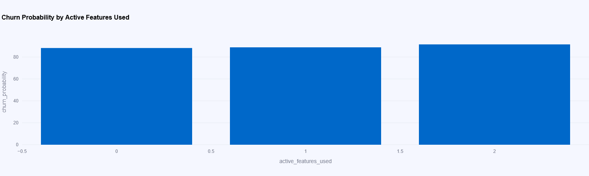
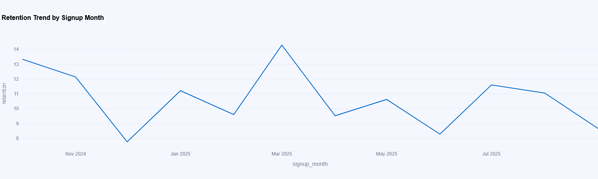
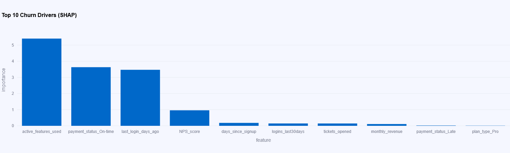

# 🧠 Churnaizer – SaaS Churn Prediction Dashboard

A production-ready **data analytics and machine learning system** that predicts customer churn, estimates **revenue at risk**, and provides **actionable retention recommendations** for SaaS founders and product teams.

Built with **Python, XGBoost, Random Forest, and Streamlit**, and deployed on **Render (API)** + **Streamlit Cloud (Frontend)**.

🔗 **Live App:** [https://churnaizer.streamlit.app/predict](https://churnaizer.streamlit.app/predict)  
 

---

## 🚀 Overview

Churnaizer analyzes SaaS customer behavior using key business metrics such as activity, engagement, NPS, feature usage, and payment consistency to predict churn risk.  
It translates predictions into **clear insights and recommendations** that help teams make data-backed retention decisions.

### 🎯 Business Impact
- Identified **$82,000+ monthly revenue at risk** for test dataset of 100K SaaS customers.
- Automated risk segmentation (High, Medium, Low) based on predicted churn probability.
- Delivered actionable playbooks for each segment, improving retention strategy and targeting.

---

## 🧩 Features

- **Dual ML Models:** XGBoost + Random Forest for robust churn prediction.
- **Real-Time API:** Hosted on Render, serving live prediction responses.
- **Interactive Dashboard:** Built with Streamlit for analytics and visualization.
- **Revenue Insights:** Calculates churn risk and financial exposure.
- **Explainable AI:** Displays SHAP-based top 10 churn drivers.
- **Prescriptive Recommendations:** Suggests what to do for each risk segment (High, Medium, Low).

---

## 📊 Insights Dashboard

**Available Metrics:**
- Total Active Users  
- Revenue at Risk  
- Average Churn Rate  
- Churn Rate by Plan Type  
- Churn Rate by Feature Usage  
- Top 10 SHAP Importance Factors  

**Visualization Example:**
- Bar chart of churn by plan  
- Feature usage vs. churn correlation  
- Horizontal SHAP importance chart  
- KPI cards for churn and revenue metrics  

---

## 🎯 Recommendations Section

| Risk Level | Suggested Action | Purpose |
|-------------|------------------|----------|
| 🔴 **High Risk (≥ 0.7)** | Offer discount, personal support call, or onboarding review | Retain top-value at-risk users |
| 🟡 **Medium Risk (0.4–0.7)** | Send feature tutorials or re-engagement campaigns | Improve feature adoption |
| 🟢 **Low Risk (< 0.4)** | Upsell or referral programs | Reinforce loyalty & advocacy |

Each customer segment includes metrics on total revenue, average churn rate, and NPS correlation.

---

## 🧠 Model Architecture

**Input Fields:**
`customer_id`, `monthly_revenue`, `days_since_signup`, `last_login_days_ago`,  
`logins_last30days`, `active_features_used`, `tickets_opened`, `NPS_score`,  
`plan_type`, `payment_status`

**Outputs:**
- `churn_probability` → Float (0–1)
- `revenue_at_risk` → Float (USD)
- `risk_category` → "Low", "Medium", "High"
- `top_factors` → List of top churn drivers
- `recommendation` → Text instruction per user

---

## 🧮 Model Performance

| Model | Accuracy | Precision | Recall | F1-Score |
|--------|-----------|-----------|---------|-----------|
| **XGBoost** | 0.915 | 0.834 | 0.824 | 0.829 |
| **Random Forest** | 0.918 | 0.842 | 0.824 | 0.833 |

Both models were trained on 100K SaaS customer records using an 80/20 stratified split to maintain class balance.

---

## 🏗️ System Architecture

Customer Data → Streamlit Frontend → Render API → ML Models (XGBoost, RF)
↘︎ Business Insights + SHAP Drivers + Recommendations


---

## 🧱 File Structure


## 📈 Graphs Explained

### 1. Churn Probability by Plan Type

- **X-Axis:** Plan type (Free, Basic, Pro …)
- **Y-Axis:** Churn probability (%)
- **What It Shows:** Compares churn likelihood across different subscription tiers.
- **Business Benefit:** Highlights which plans need retention initiatives or pricing tweaks.

### 2. Feature Adoption vs Churn Risk

- **X-Axis:** Number of active features used
- **Y-Axis:** Churn probability (%)
- **What It Shows:** Relationship between product engagement (feature usage) and churn.
- **Business Benefit:** Reveals under-used features and upsell or education opportunities.

### 3. Cohort Retention by Signup Month

- **X-Axis:** Signup month
- **Y-Axis:** Retention (%)
- **What It Shows:** Retention trend over time for user cohorts.
- **Business Benefit:** Detects seasonal issues and measures impact of experiments or campaigns.

### 4. Top 10 Churn Drivers (SHAP)

- **X-Axis:** Features (ranked by importance)
- **Y-Axis:** Importance score (mean |SHAP|)
- **What It Shows:** Variables that most influence the churn model’s predictions.
- **Business Benefit:** Focuses roadmap and marketing efforts on high-impact factors.

> Replace the **images/*.png** placeholders with real screenshots of your dashboard charts for a richer README.


---

## 🧱 File Structure


📂 saas-churn-prediction-dashboard
┣ 📂 models
┃ ┣ churnaizer_model.pkl
┃ ┗ churnaizer_saas_model.pkl
┣ 📂 data
┃ ┗ sample_customers.csv (optional)
┣ 📂 pages
┣ 📄 app.py
┣ 📄 requirements.txt
┣ 📄 architecture_diagram.png
┗ 📄 README.md


---

## ⚙️ Setup & Deployment

### Local Setup
```bash
git clone https://github.com/Shaikhsadique3/saas-churn-prediction.git
cd saas-churn-prediction-dashboard
pip install -r requirements.txt
streamlit run app.py

Deployment


Frontend (Dashboard): Streamlit Cloud

Integration: REST API via requests.post() JSON calls

🧰 Tech Stack

Languages: Python

Frameworks: Streamlit, FastAPI

ML Libraries: Scikit-learn, XGBoost, Random Forest, SHAP

Visualization: Plotly, Pandas, Matplotlib

Deployment: Render + Streamlit Cloud

Data Size: 100,000+ customer records

📘 Maintenance & Notes

Retrain models periodically as new customer data arrives.

Monitor API latency on Render free tier (cold start delays possible).

Keep requirements.txt synced with model environment versions.

🏁 Author

👤 Shaikh Sadique
Data Analyst & ML Developer
📧 founder@churnaizer.com / shaikhsadique2222@gmail.com 
🔗 [X (Twitter)](https://x.com/Shaikh_Sadique3)
🔗 [LinkedIn](https://www.linkedin.com/in/shaikh-sadique-131341356)

🔗 https://churnaizer.streamlit.app/predict

🏷️ Keywords

#DataAnalytics #MachineLearning #ChurnPrediction #SaaS #CustomerRetention #Streamlit #XGBoost #Python #BusinessIntelligence